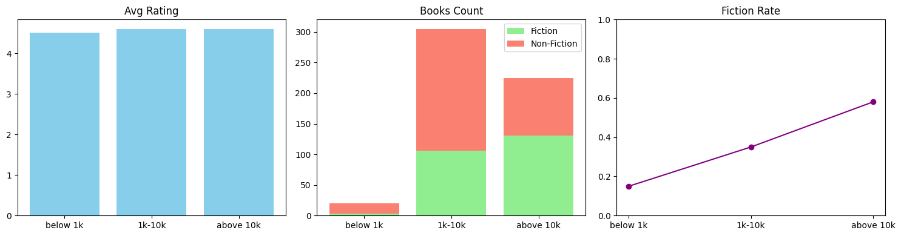

# Amazon Bestsellers (2009–2019) — SQL Analysis

## Project Overview

Analyzed 550 Amazon bestselling books (2009–2019) using SQL to identify trends in ratings, pricing, genre shifts, and author performance.

Goal: Understand what drives commercial success in the bestseller market.

---

# Key Insights

### 1. Ratings: Market Became More Quality-Concentrated

* Average rating increased from **4.58 (2009)** → **4.74 (2019)**.
* Bestsellers increasingly cluster around high ratings.

**Insight:** High ratings became standard for visibility, though small rating differences do not strongly explain sales scale.

### 2. Pricing: Shift to Volume-Driven Growth

* Prices peaked around **2014** and declined afterward.
* Most bestsellers fall within the **$4–$46** range.
* Non-Fiction supports higher price ceilings.

**Insight:** After 2014, growth relied more on **sales volume and engagement** than price increases.

### 3. Genre Shift: Fiction Peak → Non-Fiction Expansion

* 2013–2014: Fiction revenue dominance.
* 2015–2019: Structural shift toward Non-Fiction.
* 2018 marked strongest year for Non-Fiction performance.

**Insight:** Market demand shifted toward practical and self-improvement content.

### 4. Author Brand Power

* 46 repeat authors appear multiple times.
* Repeat and non-repeat authors have similar ratings (~4.6).
* Repeat authors slightly more common in Non-Fiction.

**Insight:** Brand consistency supports repeated success, but ratings alone do not drive repeat appearances.

### 5. Ratings vs Commercial Success

* High ratings are common across all review levels.
* Books with >10k reviews do not have higher ratings than others.
* Some lower-rated books (3.3–3.8) still achieved high review volume.

**Insight:** Visibility, scale, and marketing likely drive commercial success more than small rating differences.

---

# Conclusion

From 2009–2019, the bestseller market became:

* More **quality-concentrated**
* More **volume-driven**
* Increasingly **Non-Fiction-led**
* Influenced by **brand presence**, not just ratings
